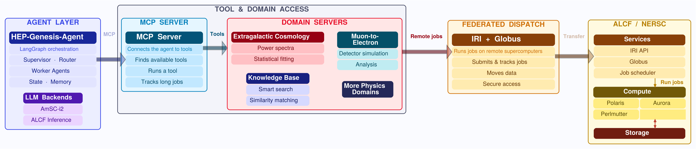
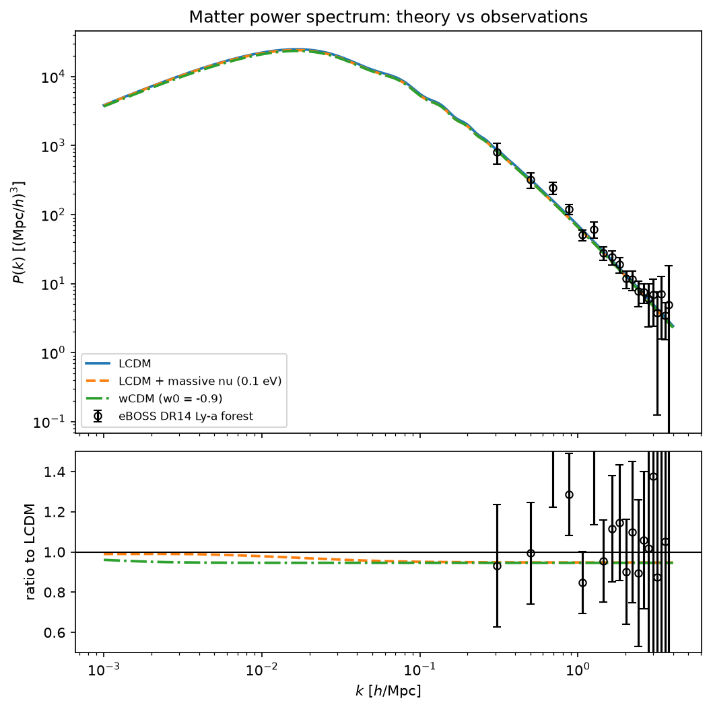

<!--
  All tutorial pages live in this one file. See docs/README.md for the full syntax.
  Quick version:
    - Each page starts with a +++ header block (id, title, group, ...).
    - Everything after it, up to the next +++, is ordinary Markdown.
    - Containers:  ::: split / ::: card / ::: grid / ::: steps / ::: note / ::: warn / ::: actions / ::: query
      close with a line of just :::   Inside ::: split, a line of just ||| starts the next column.
-->

+++
id: cover
title: Tutorial: *Building Scientific Agents*
nav: Start here
group: Introduction
layout: cover
eyebrow: Hands-on tutorial · two Python repos
lede: A LangGraph multi-agent client talks to a cosmology MCP server, plans the analysis, calls the tools, and reproduces a matter power spectrum figure from a single query.
byline: HEP-Knowledge Extraction
+++

::: grid
::: card
###### Server
### [github.com/HEP-KE/spectra-mcp-server](https://github.com/HEP-KE/spectra-mcp-server)
FastMCP server exposing 4 tools around the CLASS Boltzmann code.
:::
::: card
###### Client
### [github.com/HEP-KE/multiagent-client-demo](https://github.com/HEP-KE/multiagent-client-demo)
LangGraph client, ~250 lines: two LLM roles (lead + worker).
:::
:::

::: actions
[Begin →](#why) [Jump to setup](#setup-env)
:::

<p class="keys">Use <kbd>←</kbd> <kbd>→</kbd> to move between pages, or switch to <em>Scroll</em> to read everything on one page.</p>


+++
id: why
title: Why do we need agentic systems for science?
group: Introduction
kicker: Motivation
+++

::: split even
### Agentic systems vs LLM calls

Limitations in LLMs can be overcome with agentic systems.

- Knowledge cut-off vs RAG / knowledge databases
- Fabrication of synthetic data / codes vs custom tools
- Big-data handling

### Custom agentic systems vs commercial LLM harnesses

- Reasoning abilities of LLMs + coding expertise to be combined with scientific datasets
- Custom tools and custom harnesses provide a higher level of trust in the results
- Ability to work with HPC clusters and exascale codes
- Privacy and control concerns
- Scaling across large scientific user base
- Reusability vs token usage concerns
|||

:::


+++
id: architecture
title: Agentic systems: client + server model
nav: Client + server model
group: Introduction
kicker: Architecture
+++



**Multi-agent systems with HPC scaling:** harnesses on local systems, hosted servers for each sub-field, APIs for control and transfer.

- Integration with Genesis Mission projects (HEP-Knowledge extraction and Quarks2Cosmos): customized agentic systems for physics.
- Tutorials, slack channels, and public GitHub repos are available outside the collaborations.
  - Significant interest from science collaborations, universities and industry partners.
- Bridge between DOE-Genesis platform and science teams.
  - Topics: LSST-DESC data exploration, Mu2e studies, EIC simulation-based inference, DESI clustering pipelines, beamline optimization, foundation models for HEP and NP, ….


+++
id: mcp
title: Interfacing between LLMs and tools
nav: Interfacing LLMs and tools
group: Introduction
kicker: Protocol
+++

::: split right
#### MCP: a standard interface between agents and tools

- Write the tool once and host it on a server. Any MCP-speaking client (our LangGraph client, Claude Code, Codex) can call it.
- The server owns the science: the data files and plotting all live server-side.
- The client only sees tool schemas and small results, fully isolated from the servers.

#### Multiple ways to manage MCP

- **stdio:** the client launches the server as a subprocess (same machine).
- **streamable-http:** the server runs anywhere, and clients connect over the network. Covered today.
|||

:::


+++
id: repos
title: Two Python-based repos for client and server
nav: Today's two repos
group: Introduction
kicker: Today's tutorial
+++

::: grid
::: card
### [HEP-KE/spectra-mcp-server](https://github.com/HEP-KE/spectra-mcp-server)
- FastMCP server exposing 4 tools around the CLASS Boltzmann code.
- Bundled eBOSS DR14 Ly-α forest P(k) data (19 bins, Chabanier+ 2019).
- `notebooks/01_manual_pipeline.ipynb`: the science by hand, no LLM.
:::
::: card
### [HEP-KE/multiagent-client-demo](https://github.com/HEP-KE/multiagent-client-demo)
- LangGraph client, ~250 lines: two LLM roles (lead + worker).
- `notebooks/02_demo_client.ipynb`: the agent run, over HTTP.
- `notebooks/03_next_steps.ipynb`: stdio, Groq, skills, memory.
:::
:::

::: split
::: query
###### Sample query for the agent · notebook 02
```text
TASK = f"""Compute the linear matter power spectrum at z=0
for three cosmologies:
    (1) standard LCDM,
    (2) LCDM with total neutrino mass 0.10 eV, and
    (3) wCDM with w0=-0.9.
Then plot all three against the eBOSS DR14 Lyman-alpha forest data,
using LCDM as the ratio reference. Save all files to {OUTPUT_DIR}."""
```
:::
|||

:::


+++
id: setup-env
title: Clone, install, verify
group: Setup
kicker: Pre-session setup · about 10 minutes
sub: Please do this before the tutorial. The tutorial involves 2 repos. One Python environment serves both, and you also need access to LLM tokens.
+++

::: steps
### Clone both repos side by side

```console
$ git clone https://github.com/HEP-KE/spectra-mcp-server.git
$ git clone https://github.com/HEP-KE/multiagent-client-demo.git
```

The client notebook assumes `../spectra-mcp-server` exists.

### Create the conda environment

```console
$ conda create -n spectra-tutorial python=3.12 -y
$ conda activate spectra-tutorial

$ cd spectra-mcp-server
$ pip install cython numpy
$ pip install -e ".[dev]"

$ cd ../multiagent-client-demo
$ pip install -r requirements.txt
```

The first `pip install` provides build helpers for `classy`. The second pulls in classy/CLASS, mcp, and the rest of the necessary packages.

### Verify CLASS works

```console
$ python -c "from classy import Class; c = Class(); c.set({'output':'mPk'}); c.compute(); print('CLASS OK')"
```

If `pip install classy` failed (it compiles C code):

- **macOS:** run `xcode-select --install`, then retry `pip install classy`.
- **Any platform:** `conda install -c conda-forge classy`.
:::


+++
id: setup-keys
title: Get a free API key from Gemini and Groq
nav: Free API keys
group: Setup
kicker: Pre-session setup · step 4
+++

::: split
::: steps
### Sign in to Google AI Studio

Go to [aistudio.google.com/apikey](https://aistudio.google.com/apikey) and log in with your Google account. Make sure there are no credit cards on file.

### Create API key

Copy the key and save it somewhere private.

### Create your `.env`

In `multiagent-client-demo/`, copy the provided example and add your key.

```console
$ cp .env.example .env
# edit .env:  GOOGLE_API_KEY=AIza...
```

The `.env` file is gitignored. Never commit keys.

### Recommended backup: a free Groq key

Sign up at [console.groq.com/keys](https://console.groq.com/keys) with an email, no credit card. Add it to `.env` as `GROQ_API_KEY=...`.

Groq serves open-weight US models (gpt-oss-120b) at ~14,400 requests/day. In the notebook it's just `make_llm("groq")` instead of `make_llm()`.

If your university, lab, or collaboration provides tokens, those can be included too.
:::
|||
::: warn
**Budget warning.** As of mid-2026 the Gemini free tier allows ~20 requests per day. In a typical API plan, once the free quota is exhausted, you start paying per token. To avoid this charge, simply do not link any credit card for payment.
:::

::: note
One full agent run in the tutorial uses ~10 requests, so your key is good for roughly **1–2 runs per day**. Run the test on the next page when you set up, then leave the key alone until the session. Quota resets at midnight Pacific.
:::
:::


+++
id: setup-test
title: Test the setup
group: Setup
kicker: Pre-session setup · step 5
sub: Run the server's test suite, then ask the model to say READY.
+++

```console
$ cd spectra-mcp-server && pytest
$ cd ../multiagent-client-demo && python -c "
from dotenv import load_dotenv; load_dotenv()
from agents import make_llm
print(make_llm().invoke('Say READY').content)"
```

::: grid
::: card
###### Expected from pytest
`7 passed`
:::
::: card
###### Expected from the model
`READY`
:::
:::

If both print, you're set. If things don't work, please [raise an issue on GitHub](https://github.com/HEP-KE/multiagent-client-demo/issues).


+++
id: setup-hosted
title: Try the hosted servers from an AI app
nav: Try the hosted servers
group: Setup
kicker: Pre-session setup · step 6 · optional, highly recommended
sub: The tutorial servers, plus a larger production cosmology server, run on a public demo host. You can talk to them from Claude desktop, ChatGPT, Claude Code, Codex, or Cursor **with nothing installed**, and get a feel for what the tutorial builds.
+++

::: actions
[Setup per app, server URLs, and sample questions →](https://github.com/HEP-KE/multiagent-client-demo/blob/main/link_servers.md)
:::


+++
id: server-tools
title: Tools are plain Python functions
group: Server
kicker: Server · spectra-mcp-server
+++

::: split
```python title="tools/spectra_tools.py" link="https://github.com/HEP-KE/spectra-mcp-server/blob/main/tools/spectra_tools.py"
@validate_call
def compute_power_spectrum(
    model: Literal["lcdm", "nu_mass", "wcdm"],
    output_dir: str,
    sum_mnu_eV: Annotated[float, Field(ge=0, le=1.0)] = 0.10,
    w0: Annotated[float, Field(ge=-2.0, le=-0.3)] = -0.9,
    ...
) -> ArtifactResult:
    """Compute a linear matter power spectrum P(k)
    with the CLASS Boltzmann code.

    Use this tool once per cosmological model. It
    writes a CSV file and returns its path. Pass the
    returned file path to plot_power_spectra —
    never copy the numbers.
    """
```
|||
#### No MCP imports here

- Type hints, `Field` constraints, and the docstring become the tool schema the agent sees.
- `ArtifactResult`: status, files, message, metadata.
- Arrays travel as CSV file paths, never through the LLM context.
:::


+++
id: server-wrapper
title: From Python package to MCP server
nav: From package to MCP server
group: Server
kicker: Server · spectra-mcp-server
+++

::: split
```toml title="pyproject.toml" link="https://github.com/HEP-KE/spectra-mcp-server/blob/main/pyproject.toml"
[tool.mcp-server]
tool_modules = ["tools"]
```

```python title="tools/__init__.py" link="https://github.com/HEP-KE/spectra-mcp-server/blob/main/tools/__init__.py"
__all__ = [
    "get_eboss_data", "list_cosmology_models",
    "compute_power_spectrum", "plot_power_spectra",
]
```

```console title="Run it · terminal, in spectra-mcp-server/"
$ python -m mcp_server --transport streamable-http --port 8000
# clients connect to http://127.0.0.1:8000/mcp
```
|||
#### A generic wrapper

- `mcp_server/` reads pyproject, imports the modules, and registers every name in `__all__` as an MCP tool.
- Add your own science: drop in a module, extend `__all__`. Nothing else changes.
:::


+++
id: client-connect
title: Connect to the server, pick an LLM
group: Client
kicker: Client · multiagent-client-demo
+++

::: split
```console title="Open the notebook · second terminal, in multiagent-client-demo/"
$ jupyter lab notebooks/02_demo_client.ipynb
```

```python title="notebooks/02_demo_client.ipynb" link="https://github.com/HEP-KE/multiagent-client-demo/blob/main/notebooks/02_demo_client.ipynb"
HTTP_CONFIG = {
    "spectra": {
        "transport": "streamable_http",
        "url": "http://127.0.0.1:8000/mcp",
    }
}
tools = await load_tools(HTTP_CONFIG)
```

```python title="agents/llm.py" link="https://github.com/HEP-KE/multiagent-client-demo/blob/main/agents/llm.py"
llm = make_llm()         # Gemini free tier (default)
llm = make_llm("groq")   # alt: open-weight gpt-oss-120b
```
|||
#### MCP tools → LangChain tools

- `langchain-mcp-adapters` fetches the schemas. The client can now call server code it has never imported.

#### Compatible LLM endpoints

- The free version of Gemini Flash is the default. OpenAI gpt-oss-120b, an open-weight model hosted on Groq, is an alternative.
- Any compatible LLM will work (Anthropic, OpenAI models).
- Keys live in `.env`, never in code.

#### Note

- The Gemini free tier provides ~20 requests/day, about one full agent run.
- The LLM is not state-of-the-art by any means. Token costs can rise for paid models.
:::


+++
id: client-roles
title: Two LLM roles: lead and worker *(subagents)*
nav: Two LLM roles: lead and worker
group: Client
kicker: Client · multiagent-client-demo
+++


::: split right
#### Lead · visited twice

- First visit: break the task into a 2–5 step JSON plan.
- Last visit: write the final markdown report.

#### Worker · once per step

- A ~10-line ReAct loop: call tools until the model replies with text.
- Fresh messages each step. File paths from earlier steps are passed as context.
|||
```python title="agents/nodes.py · the worker loop" link="https://github.com/HEP-KE/multiagent-client-demo/blob/main/agents/nodes.py"
for _ in range(MAX_TOOL_ITERATIONS):
    reply = await _ainvoke(bound, messages)
    messages.append(reply)
    if not reply.tool_calls:
        break
    for call in reply.tool_calls:
        result = await tools_by_name[call["name"]] \
            .ainvoke(call["args"])
        messages.append(
            ToolMessage(str(result),
                        tool_call_id=call["id"]))
```
:::


+++
id: client-graph
title: The graph: routing is plain Python
group: Client
kicker: Client · multiagent-client-demo
+++


::: split
```python title="agents/graph.py" link="https://github.com/HEP-KE/multiagent-client-demo/blob/main/agents/graph.py"
def route_from_worker(state):
    if state["current"] < len(state["plan"]):
        return "worker"      # more steps to run
    return "lead"            # plan done -> report

graph = StateGraph(AgentState)
graph.add_node("lead", make_lead(llm, tools))
graph.add_node("worker", make_worker(llm, tools))
graph.add_edge(START, "lead")
graph.add_conditional_edges("lead", route_from_lead,
                            ["worker", END])
graph.add_conditional_edges("worker", route_from_worker,
                            ["worker", "lead"])
return graph.compile()
```
|||
#### The flow

START → lead (plan) → worker → worker → … → lead (report) → END

#### The “supervisor” is deterministic

- Two if-statements route the whole system. Not every agent in a multi-agent system needs to be an LLM call.
:::


+++
id: client-state
title: State: what flows through the graph
group: Client
kicker: Client · multiagent-client-demo
+++


::: split
```python title="agents/state.py" link="https://github.com/HEP-KE/multiagent-client-demo/blob/main/agents/state.py"
class AgentState(TypedDict):
    task: str                # the user's science question
    plan: list[Step]         # written once by the lead
    current: int             # index of the next step
    step_results: list[str]  # one summary per step
    final_report: str        # written by the lead, at the end
    history: list[str]       # previous runs (for follow-ups)
```
|||
#### Agent state through a directed graph

- Minimal setup: no worker types, no checkpointing. Production systems grow each of those.
- Every node receives the state and returns a partial update. LangGraph merges it.

*A [snapshot of the state mid-run](#backup-state) is in the backup pages.*
:::


+++
id: scope
title: What we cover today, and what we don't
nav: What we cover, and what we don't
group: Wrap-up
kicker: Scope
+++

::: grid three
::: card
###### Covered
- **01:** building science tools by hand. CLASS spectra vs eBOSS DR14, tools called as plain Python.
- Launch the MCP server over streamable-http, and list its tools from the client.
- **02:** the agent run. Plan → tool calls → report, streamed live.
- **Eval:** the agent's figure vs the ground-truth figure, side by side.
:::
::: card
###### Implemented, not covered · notebook 03
- stdio transport
- Different LLM backend
- Skills
- Memory
- Follow-up runs
:::
::: card
###### Not implemented
- Parallel workers
- Checkpointing / human-in-the-loop
- Systematic evals
- Auth + deployment
- Multiple servers
:::
:::


+++
id: backup
title: Skills, memory, follow-ups & backends
nav: Backup: extras
group: Backup
layout: divider
kicker: Backup
sub: Demo in `notebooks/03_next_steps.ipynb`
+++


+++
id: backup-skills
title: Skills: recipes loaded on demand
nav: Skills: recipes on demand
group: Backup
kicker: Backup
+++

::: split
```markdown title="skills/cosmology-comparison.md" link="https://github.com/HEP-KE/multiagent-client-demo/tree/main/skills"
---
name: cosmology-comparison
description: Recipe for comparing matter power spectra
  of several cosmologies against the eBOSS data
---
# Cosmology comparison recipe
1. Call list_cosmology_models first if unsure ...
2. Compute the reference model (usually lcdm) FIRST ...
```

```python title="agents/skills.py" link="https://github.com/HEP-KE/multiagent-client-demo/blob/main/agents/skills.py"
@tool
def load_skill(name: str) -> str:
    """Load the full instructions of a named skill."""
    ...
```
|||
#### Skill vs tool

- A tool is a capability. A skill is know-how: *how* to use the tools well.

#### Progressive disclosure

- The lead only sees a name + description index at planning time. The worker loads the full text when a step needs it.
- Opt-in: `build_graph(llm, tools, extras=True)`.

*Same idea as Claude Code's Agent Skills.*
:::


+++
id: backup-memory
title: Memory: lessons that survive across runs
nav: Memory across runs
group: Backup
kicker: Backup
+++

::: split
```python title="agents/memory.py" link="https://github.com/HEP-KE/multiagent-client-demo/blob/main/agents/memory.py"
@tool
def remember(lesson: str) -> str:
    """Save a one-line lesson to persistent memory
    for future runs. Use this sparingly, when you
    learn something non-obvious that would help
    next time."""
    with MEMORY_FILE.open("a") as f:
        f.write(f"- {lesson.strip()}\n")
```
|||
#### MEMORY.md at the repo root

- Read into the lead's planning prompt at the start of every run.
- The `remember` tool lets the agent append a lesson worth keeping.

*The smallest possible version of the memory systems in coding agents.*

- In our test runs the agent wrote its own lesson, unprompted.
:::


+++
id: backup-followup
title: Follow-up runs and switching backends
nav: Follow-ups and backends
group: Backup
kicker: Backup
+++

::: split
```python title="agents/graph.py" link="https://github.com/HEP-KE/multiagent-client-demo/blob/main/agents/graph.py"
def follow_up(previous, task):
    """A new run that remembers the previous one."""
    entry = (f"Task: {previous['task']}\n"
             f"Outcome: {previous['final_report']}")
    return {**new_run(task),
            "history": previous["history"] + [entry]}
```

```python title="Switching backends"
llm = make_llm("groq")   # that's the whole switch
```
|||
#### Follow-ups

- The `history` field carries summaries of previous runs. “Now add w0=-1.1” reuses yesterday's CSVs instead of recomputing.

#### Backends

- No automatic fallback by design. If a key runs dry, you switch explicitly and know you did.
:::


+++
id: backup-state
title: The state mid-run: between steps 2 and 3
nav: The state mid-run
group: Backup
kicker: Backup
+++

::: split
```python title="AgentState after the worker finishes step 2 (of 4)"
{
  "task": "Compute P(k) at z=0 for three cosmologies ...",
  "plan": [
    {"id": 1, "description": "Compute the LCDM spectrum"},
    {"id": 2, "description": "Compute the 0.10 eV nu_mass spectrum"},
    {"id": 3, "description": "Compute the wCDM (w0=-0.9) spectrum"},
    {"id": 4, "description": "Plot all three vs the eBOSS data"},
  ],
  "current": 2,           # next up: plan[2] -> step 3
  "step_results": [
    "Wrote agent-output/pk_lcdm.csv",
    "Wrote agent-output/pk_nu_mass.csv",
  ],
  "final_report": "",     # still empty
  "history": [],          # first run, no follow-up
}
```
|||
#### Where are we?

- The worker just finished `plan[1]`. `route_from_worker` sees `current` (2) < `len(plan)` (4) and returns “worker”. No LLM involved.

#### Handoffs are file paths

- `step_results` carries the CSV paths. The next worker visit gets them as context and reuses them instead of recomputing.
- `final_report` stays empty until the lead's last visit, after step 4.
:::
